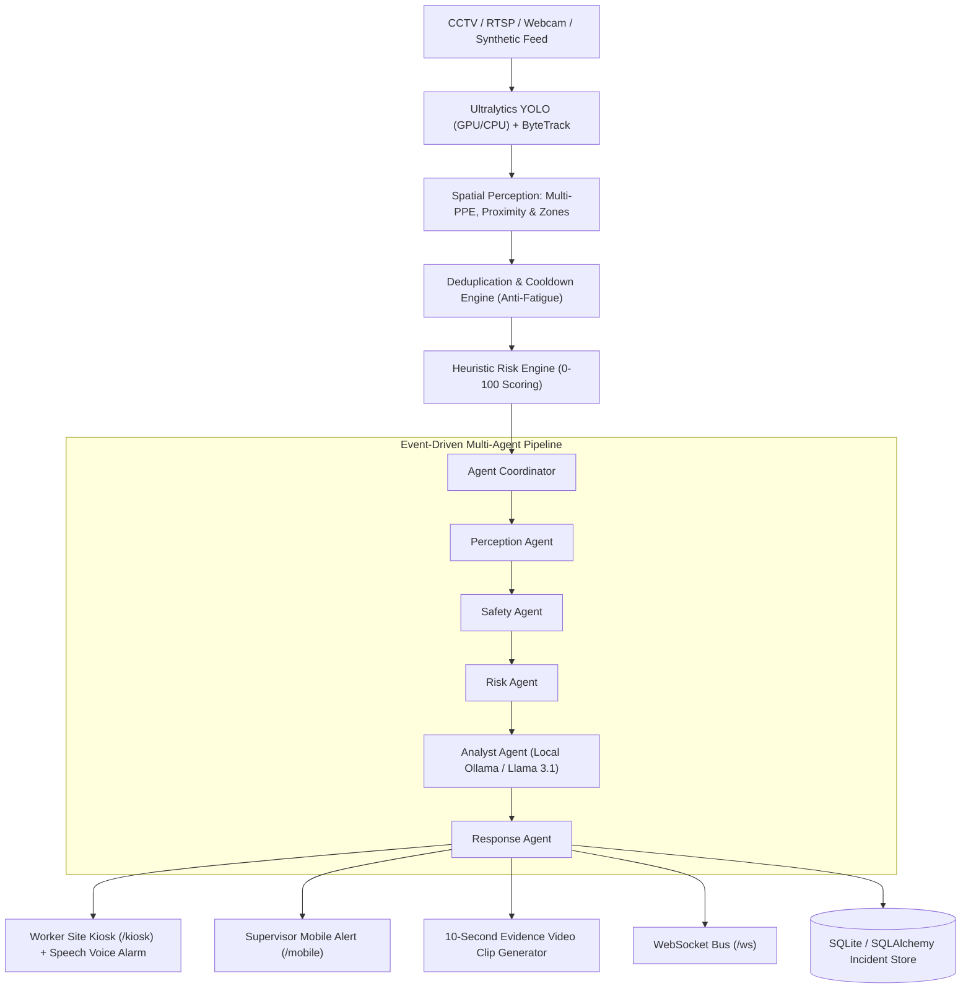

Hawk-Eye
A distributed AI safety system for construction sites that uses multiple vision agents to detect hazards coordinate across zones, assess risk, and trigger real time local and supervisor alerts.
> *"We turn construction CCTV from a recording system into an active safety system."*  
> **AI-assisted safety monitoring • Human-in-the-loop**

---

## 1. Product Overview
Construction sites worldwide already deploy hundreds of CCTV cameras, but they act almost entirely as **passive recording systems**. When a dangerous event occurs (worker without a hard hat, an unauthorized entry into a crane radius, or a worker stepping behind a reversing 20-ton dump truck), human operators rarely notice until an injury is reported.

**Hawk-Eye transforms existing CCTV into an active safety system.** It processes video streams with edge computer vision, evaluates spatial hazard rules, computes a transparent 0–100 risk score, sounds instant local kiosk audio alarms to nearby workers, alerts supervisors on their mobile devices with 10-second forensic evidence clips, and builds a live site risk heatmap.

---

## 2. System Architecture



---

## 3. Key Features

### 🦺 Comprehensive Multi-PPE Violation Engine
Detects and classifies violations across the entire construction safety matrix:
- **Head Protection**: Hard hat / helmet missing (`no_helmet`)
- **Body Protection**: High-visibility fluorescent vest missing (`no_vest`)
- **Fall Protection**: Safety harness unattached in elevated zones (`no_harness`)
- **Extremities**: Protective gloves (`no_gloves`) & Steel-toe boots (`no_boots`)
- **Compound Violations**: Multi-PPE simultaneous failures (`compound_ppe_violation`)

### 🚜 Vehicle-Person Proximity Hazard Detection
- Calculates real-time Euclidean distance between workers and heavy construction machinery (trucks, forklifts, excavators).
- Flags dangerous blindspot incursions and sounds directional alarms.

### 🚧 Polygon Danger Zone Breaches
- Ray-casting point-in-polygon algorithm monitoring high-hazard perimeters (Crane Swing Radii, Excavation Pits, Slab Edges).

### 🛡️ Anti-Fatigue Alert Deduplication
- Suppresses repetitive frame-by-frame alert spamming with a configurable 25-30s cooldown per `(track_id, camera_id, event_type)`.
- Tracks "Alerts Prevented by Deduplication" metric.

### 🎥 10-Second Forensic Evidence Clips
- Captures 5 seconds before + 5 seconds after an incident.
- Renders an MP4 video clip annotated with camera name, risk score, distance lines, and bounding boxes.

### 📱 Multi-Interface Control
- **Command Center Dashboard (`/`)**: 5-camera CCTV grid, live incident feed, risk heatmap, analytics, and agent logs.
- **Worker Safety Kiosk (`/kiosk`)**: Full-screen high-contrast display with browser `speechSynthesis` voice alerts.
- **Supervisor Mobile UI (`/mobile`)**: Realistic smartphone simulation with push notifications, evidence playback, and quick resolution buttons.
- **Demo Control Center (`/demo`)**: 1-click scenario triggers and automated simulation loops.

---

## 4. Tech Stack

- **Backend**: Python 3.12+, FastAPI, Uvicorn, SQLAlchemy, SQLite, WebSockets, OpenCV, Pydantic.
- **Computer Vision**: Ultralytics YOLO (`yolo11n.pt` / `yolov8n.pt`), ByteTrack anonymous tracking, CUDA/CPU auto-detection.
- **AI Agents & Local LLM**: Modular event agents, Ollama (`llama3.1:latest`, `qwen2.5vl:latest`), with deterministic industrial fallback templates.
- **Frontend**: React 18, Vite, TypeScript, Tailwind CSS, Lucide Icons.

---

## 5. Quick Start Guide

### Prerequisites
- Python 3.10+
- Node.js 18+ and npm

### One-Click Start (Windows PowerShell)
```powershell
.\Hawk-Eye\scripts\start.ps1
```

### One-Click Start (Linux / macOS / Bash)
```bash
chmod +x Hawk-Eye/scripts/*.sh
./Hawk-Eye/scripts/start.sh
```

### Manual Development Startup

#### Terminal 1: FastAPI Backend
```powershell
cd Hawk-Eye/backend
$env:PYTHONPATH = "."
python -m uvicorn app.main:app --host 127.0.0.1 --port 8000 --reload
```

#### Terminal 2: React Vite Frontend
```powershell
cd Hawk-Eye/frontend
npm run dev
```

---

## 6. URLs & Endpoints

| Interface | URL | Purpose |
| :--- | :--- | :--- |
| **Command Center Dashboard** | `http://localhost:3000/` | Multi-cam monitoring, incident management, analytics |
| **Worker Safety Kiosk** | `http://localhost:3000/kiosk` | Worker visual HUD + voice audio alarms |
| **Supervisor Mobile Phone** | `http://localhost:3000/mobile` | Smartphone dispatch, video evidence, quick action |
| **Demo Control Center** | `http://localhost:3000/demo` | 1-click scenario triggers & simulation loop |
| **API Documentation** | `http://localhost:8001/docs` | Interactive Swagger / OpenAPI docs |

---

## 7. Privacy Statement
> **Video analysis is performed strictly for site safety. Hawk-Eye does not perform facial recognition, biometric profiling, or worker identity tracking. All detections use temporary anonymous track identifiers.**
