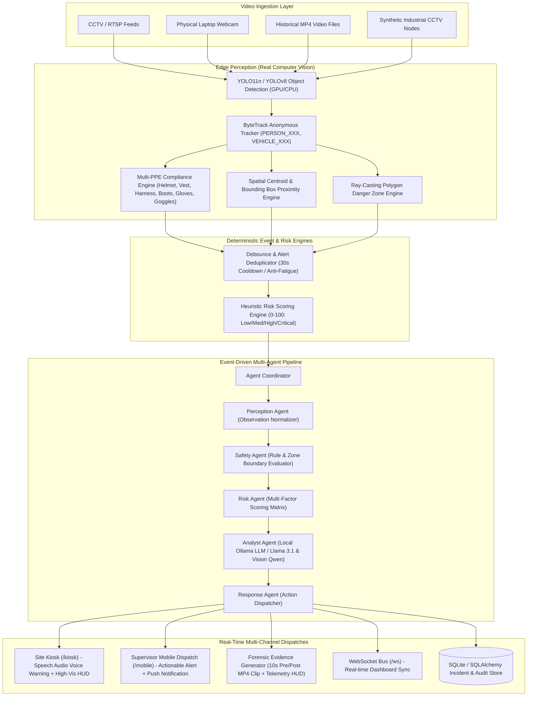

# SAHAYI Architecture Documentation

"We turn construction CCTV from a recording system into an active safety system."

## High-Level System Architecture

## Architectural Tenets
1. **Perception $\neq$ Decision**: Computer vision provides perception only (`"YOLO is the eyes, not the brain"`). Safety-critical decisions are governed by deterministic rule thresholds and mathematical hazard models.
2. **No Frame-by-Frame LLMs**: LLMs are never executed per video frame. LLMs (Ollama `llama3.1`) process structured event outputs to generate forensic summaries and executive briefs.
3. **Anti-Fatigue Deduplication**: Continuous CCTV streams debounce repetitive detections through a persistent state cooldown engine, preventing alert fatigue for safety supervisors.
4. **Forensic Evidence Buffering**: High/Critical alerts automatically synthesize a 10-second MP4 video clip (5 seconds pre-event + 5 seconds post-event) with embedded camera name, risk score, and hazard vectors.
